# GS365 Database Schema Documentation

## 📊 Database Overview

The GS365 platform uses **MySQL 8.0+** with **37 tables** organized into logical domains. The database is managed using **Drizzle ORM** for type-safe queries and migrations.

## 🎨 Visual ER Diagram

**Interactive Database Diagram**: [View on dbdiagram.io](https://dbdiagram.io/d/695c154239fa3db27b2ae254)

You can also find the DBML source code in [`DATABASE_SCHEMA.dbml`](./DATABASE_SCHEMA.dbml) to create your own diagrams or modifications.

---

## 🗺️ Entity Relationship Diagram

### Core System Architecture

```mermaid
erDiagram
    %% User Management Domain
    users ||--o{ transactions : "makes"
    users ||--o{ bet_results : "places"
    users ||--o{ user_login_history : "has"
    users ||--o{ user_phones : "has"
    users ||--o{ user_favorites : "has"
    users ||--o{ chats : "participates"
    users ||--o{ notifications : "receives"
    users }o--|| currencies : "uses"
    users }o--|| countries : "from"
    users ||--o{ kyc : "submits"
    
    %% Admin User Management
    admin_users ||--o{ users : "creates"
    admin_users ||--o{ admin_users : "creates"
    admin_users ||--o{ transactions : "processes"
    admin_users ||--o{ chats : "participates"
    admin_users }o--|| designation : "has"
    admin_users ||--o{ admin_main_balance : "has"
    
    %% Gaming Domain
    games ||--o{ bet_results : "used_in"
    games ||--o{ user_favorites : "favorited"
    games ||--o{ featured_games : "featured_as"
    games }o--|| game_providers : "provided_by"
    
    sports ||--o{ bet_results : "used_in"
    sports }o--|| sports_providers : "provided_by"
    
    %% Transaction & Payment Domain
    transactions }o--|| users : "belongs_to"
    transactions }o--|| admin_users : "affiliate"
    transactions }o--|| currencies : "in_currency"
    transactions }o--|| promotions : "uses"
    transactions }o--|| payment_gateway_provider_accounts : "via"
    transactions }o--|| payment_gateways : "through"
    
    %% Payment System
    payment_gateways ||--o{ payment_gateway_providers : "has"
    payment_providers ||--o{ payment_gateway_providers : "linked_to"
    payment_gateway_providers ||--o{ payment_gateway_provider_accounts : "has"
    payment_methods ||--o{ payment_gateway_provider_accounts : "uses"
    payment_method_types ||--o{ payment_methods : "categorizes"
    
    %% Withdrawal Accounts
    users ||--o{ withdrawal_payment_accounts : "owns"
    withdrawal_payment_accounts }o--|| payment_methods : "uses"
    
    %% Localization
    countries ||--o{ country_languages : "supports"
    languages ||--o{ country_languages : "available_in"
    countries ||--o{ users : "has"
    currencies ||--o{ users : "used_by"
    currencies ||--o{ currency_conversion : "from"
    currencies ||--o{ currency_conversion : "to"
    
    %% CMS & Configuration
    promotions ||--o{ transactions : "applied_to"
    dropdowns ||--o{ dropdown_options : "contains"
    
    %% Communication
    chats ||--o{ messages : "contains"
    chats }o--|| users : "user_participant"
    chats }o--|| admin_users : "admin_participant"
    messages }o--|| chats : "belongs_to"
    
    %% Commission
    admin_users ||--o{ commission : "earns"
    users ||--o{ commission : "generates"
```



---

## 📋 Table Definitions

### 👥 User Management Domain

#### users
Player accounts and authentication.

| Column | Type | Constraints | Description |
|--------|------|-------------|-------------|
| id | INT | PK, AUTO_INCREMENT | Unique user ID |
| username | VARCHAR(50) | UNIQUE | Username |
| fullname | VARCHAR(100) | | Full name |
| phone | VARCHAR(20) | UNIQUE | Phone number |
| email | VARCHAR(255) | UNIQUE | Email address |
| password | VARCHAR(255) | | Hashed password |
| currency_id | INT | FK → currencies | Default currency |
| country_id | INT | FK → countries | User's country |
| refer_code | VARCHAR(50) | | Referral code |
| created_by | INT | FK → admin_users | Creator admin |
| status | ENUM | active/inactive | Account status |
| isVerified | BOOLEAN | DEFAULT false | Email verified |
| isLoggedIn | BOOLEAN | DEFAULT false | Login status |
| tokenVersion | INT | DEFAULT 0 | For token invalidation |
| device_type | VARCHAR(50) | | Device type |
| device_name | VARCHAR(100) | | Device name |
| browser | VARCHAR(50) | | Browser name |
| ip_address | VARCHAR(45) | | Last IP address |
| referred_by | INT | FK → users | Referrer user |
| referred_by_admin_user | INT | FK → admin_users | Referrer admin |
| kyc_status | ENUM | verified/unverified/required/pending | KYC status |
| created_at | DATETIME | DEFAULT CURRENT_TIMESTAMP | Creation time |

**Indexes**: username, email, phone, currency_id, country_id, created_by, referred_by

---

#### admin_users
Admin, agent, and affiliate accounts.

| Column | Type | Constraints | Description |
|--------|------|-------------|-------------|
| id | INT | PK, AUTO_INCREMENT | Unique admin ID |
| username | VARCHAR(50) | UNIQUE | Username |
| fullname | VARCHAR(100) | | Full name |
| phone | VARCHAR(20) | UNIQUE | Phone number |
| email | VARCHAR(255) | UNIQUE | Email address |
| password | VARCHAR(255) | | Hashed password |
| role | ENUM | superAdmin/admin/superAgent/agent/superAffiliate/affiliate | User role |
| designation | INT | FK → designation | Role designation |
| status | ENUM | active/inactive | Account status |
| refCode | VARCHAR(255) | UNIQUE | Referral code |
| currency | INT | FK → currencies | Default currency |
| remainingBalance | DECIMAL(20,2) | | Current balance |
| minTrx | DECIMAL | | Min transaction |
| maxTrx | DECIMAL | | Max transaction |
| commission_percent | INT | | Commission rate |
| main_balance | INT | DEFAULT 0 | Main balance |
| downline_balance | INT | DEFAULT 0 | Downline balance |
| withdrawable_balance | INT | DEFAULT 0 | Withdrawable amount |
| isVerified | BOOLEAN | DEFAULT false | Email verified |
| isLoggedIn | BOOLEAN | DEFAULT false | Login status |
| createdBy | INT | FK → admin_users | Creator admin |
| referred_by | INT | FK → admin_users | Referrer |
| kyc_status | ENUM | verified/unverified/required/pending | KYC status |
| created_at | DATETIME | DEFAULT CURRENT_TIMESTAMP | Creation time |

**Indexes**: username, email, phone, role, refCode, createdBy

---

#### user_login_history
Tracks user login attempts and sessions.

| Column | Type | Constraints | Description |
|--------|------|-------------|-------------|
| id | INT | PK, AUTO_INCREMENT | Unique ID |
| user_id | INT | FK → users | User reference |
| ip_address | VARCHAR(45) | | Login IP |
| device_type | VARCHAR(50) | | Device type |
| device_name | VARCHAR(100) | | Device name |
| browser | VARCHAR(50) | | Browser name |
| browser_version | VARCHAR(50) | | Browser version |
| os_version | VARCHAR(50) | | OS version |
| login_at | DATETIME | DEFAULT CURRENT_TIMESTAMP | Login timestamp |
| status | ENUM | success/failed | Login status |

**Indexes**: user_id, login_at, status

---

#### user_phones
Multiple phone numbers per user.

| Column | Type | Constraints | Description |
|--------|------|-------------|-------------|
| id | INT | PK, AUTO_INCREMENT | Unique ID |
| user_id | INT | FK → users | User reference |
| phone | VARCHAR(20) | NOT NULL | Phone number |
| is_primary | BOOLEAN | DEFAULT false | Primary phone |
| is_verified | BOOLEAN | DEFAULT false | Verified status |
| created_at | DATETIME | DEFAULT CURRENT_TIMESTAMP | Creation time |

**Indexes**: user_id, phone

---

#### kyc
KYC verification documents.

| Column | Type | Constraints | Description |
|--------|------|-------------|-------------|
| id | INT | PK, AUTO_INCREMENT | Unique ID |
| user_id | INT | FK → users | User reference |
| document_type | VARCHAR(50) | | ID type |
| document_number | VARCHAR(100) | | ID number |
| front_image | TEXT | | Front image URL |
| back_image | TEXT | | Back image URL |
| selfie_image | TEXT | | Selfie URL |
| status | ENUM | pending/approved/rejected | Verification status |
| verified_by | INT | FK → admin_users | Verifier |
| verified_at | DATETIME | | Verification time |
| rejection_reason | TEXT | | Rejection reason |
| created_at | DATETIME | DEFAULT CURRENT_TIMESTAMP | Submission time |

**Indexes**: user_id, status

---

### 🎮 Gaming Domain

#### games
Game catalog.

| Column | Type | Constraints | Description |
|--------|------|-------------|-------------|
| id | INT | PK, AUTO_INCREMENT | Unique game ID |
| name | VARCHAR(255) | NOT NULL | Game name |
| gameLogo | TEXT | | Logo URL |
| gameUrl | TEXT | | Game URL |
| status | ENUM | active/inactive | Game status |
| categoryInfo | JSON | | Category details |
| providerInfo | JSON | | Provider details |
| createdBy | INT | FK → admin_users | Creator |
| created_at | DATETIME | DEFAULT CURRENT_TIMESTAMP | Creation time |

**Indexes**: status, createdBy

---

#### game_providers
Game provider companies.

| Column | Type | Constraints | Description |
|--------|------|-------------|-------------|
| id | INT | PK, AUTO_INCREMENT | Unique ID |
| name | VARCHAR(255) | NOT NULL | Provider name |
| logo | TEXT | | Logo URL |
| status | ENUM | active/inactive | Provider status |
| apiKey | VARCHAR(255) | | API key |
| apiSecret | VARCHAR(255) | | API secret |
| created_at | DATETIME | DEFAULT CURRENT_TIMESTAMP | Creation time |

**Indexes**: status

---

#### bet_results
Betting history and results.

| Column | Type | Constraints | Description |
|--------|------|-------------|-------------|
| id | INT | PK, AUTO_INCREMENT | Unique bet ID |
| user_id | INT | FK → users | Player |
| game_id | INT | FK → games | Game played |
| bet_amount | DECIMAL(10,2) | NOT NULL | Bet amount |
| win_amount | DECIMAL(10,2) | DEFAULT 0 | Win amount |
| loss_amount | DECIMAL(10,2) | DEFAULT 0 | Loss amount |
| multiplier | DECIMAL(5,2) | | Win multiplier |
| bet_status | ENUM | win/loss/pending/cancelled | Bet outcome |
| playing_status | ENUM | playing/completed/abandoned | Game status |
| session_token | TEXT | | Session JWT |
| game_session_id | VARCHAR(100) | | Session ID |
| game_name | VARCHAR(255) | | Game name |
| game_provider | VARCHAR(255) | | Provider name |
| game_category | VARCHAR(100) | | Game category |
| user_score | INT | | User score |
| user_level | INT | | User level |
| ip_address | VARCHAR(45) | | Player IP |
| device_info | TEXT | | Device details |
| bet_placed_at | DATETIME | | Bet time |
| game_started_at | DATETIME | | Start time |
| game_ended_at | DATETIME | | End time |
| created_at | DATETIME | DEFAULT CURRENT_TIMESTAMP | Creation time |

**Indexes**: user_id, game_id, bet_status, playing_status, bet_placed_at

---

#### user_favorites
User favorite games.

| Column | Type | Constraints | Description |
|--------|------|-------------|-------------|
| user_id | INT | FK → users | User |
| game_id | INT | FK → games | Game |

**Composite PK**: (user_id, game_id)

---

### 💰 Transaction & Financial Domain

#### transactions
All financial transactions.

| Column | Type | Constraints | Description |
|--------|------|-------------|-------------|
| id | INT | PK, AUTO_INCREMENT | Unique transaction ID |
| userId | INT | FK → users | Player |
| affiliateId | INT | FK → admin_users | Affiliate |
| type | ENUM | deposit/withdraw/win/loss | Transaction type |
| amount | DECIMAL(10,2) | NOT NULL | Amount |
| bonusAmount | DECIMAL(10,2) | DEFAULT 0 | Bonus amount |
| conversionRate | DECIMAL | DEFAULT 100 | Currency rate |
| currencyId | INT | FK → currencies | Currency |
| promotionId | INT | FK → promotions | Promotion |
| gameId | INT | FK → games | Game |
| status | ENUM | approved/pending/rejected | Status |
| customTransactionId | VARCHAR(100) | UNIQUE | Internal TXN ID |
| givenTransactionId | VARCHAR(100) | | External TXN ID |
| attachment | TEXT | | Receipt/proof |
| notes | TEXT | | Notes |
| paymentGatewayProviderAccountId | INT | FK → payment_gateway_provider_accounts | Account |
| paymentGatewayId | INT | FK → payment_gateways | Gateway |
| accountNumber | VARCHAR(100) | | Bank account |
| accountHolderName | VARCHAR(100) | | Account holder |
| bankName | VARCHAR(100) | | Bank name |
| walletAddress | TEXT | | Crypto wallet |
| network | VARCHAR(50) | | Blockchain network |
| processedBy | INT | FK → admin_users | Processor admin |
| processedByUser | INT | FK → users | Processor user |
| processedAt | DATETIME | | Processing time |
| createdAt | DATETIME | DEFAULT CURRENT_TIMESTAMP | Creation time |
| updatedAt | DATETIME | ON UPDATE CURRENT_TIMESTAMP | Update time |

**Indexes**: userId, affiliateId, type, status, currencyId, customTransactionId, createdAt

---

#### commission
Commission tracking for affiliates.

| Column | Type | Constraints | Description |
|--------|------|-------------|-------------|
| id | INT | PK, AUTO_INCREMENT | Unique ID |
| affiliate_id | INT | FK → admin_users | Affiliate |
| user_id | INT | FK → users | Player |
| transaction_id | INT | FK → transactions | Transaction |
| commission_amount | DECIMAL(10,2) | | Commission earned |
| commission_percent | DECIMAL(5,2) | | Commission rate |
| status | ENUM | pending/paid | Payment status |
| paid_at | DATETIME | | Payment time |
| created_at | DATETIME | DEFAULT CURRENT_TIMESTAMP | Creation time |

**Indexes**: affiliate_id, user_id, transaction_id, status

---

#### admin_main_balance
Admin balance management.

| Column | Type | Constraints | Description |
|--------|------|-------------|-------------|
| id | INT | PK, AUTO_INCREMENT | Unique ID |
| admin_id | INT | FK → admin_users | Admin |
| amount | DECIMAL(20,2) | NOT NULL | Amount |
| type | ENUM | credit/debit | Transaction type |
| description | TEXT | | Description |
| balance_after | DECIMAL(20,2) | | Balance after |
| created_by | INT | FK → admin_users | Creator |
| created_at | DATETIME | DEFAULT CURRENT_TIMESTAMP | Creation time |

**Indexes**: admin_id, type, created_at

---

#### turnover
Turnover requirements for bonuses.

| Column | Type | Constraints | Description |
|--------|------|-------------|-------------|
| id | INT | PK, AUTO_INCREMENT | Unique ID |
| user_id | INT | FK → users | User |
| promotion_id | INT | FK → promotions | Promotion |
| required_turnover | DECIMAL(10,2) | | Required amount |
| completed_turnover | DECIMAL(10,2) | DEFAULT 0 | Completed amount |
| status | ENUM | active/completed/expired | Status |
| expires_at | DATETIME | | Expiry time |
| created_at | DATETIME | DEFAULT CURRENT_TIMESTAMP | Creation time |

**Indexes**: user_id, promotion_id, status

---

### 💳 Payment System Domain

#### payment_gateways
Payment gateway providers (e.g., Stripe, PayPal).

| Column | Type | Constraints | Description |
|--------|------|-------------|-------------|
| id | INT | PK, AUTO_INCREMENT | Unique ID |
| name | VARCHAR(100) | NOT NULL | Gateway name |
| logo | TEXT | | Logo URL |
| status | ENUM | active/inactive | Status |
| created_at | DATETIME | DEFAULT CURRENT_TIMESTAMP | Creation time |

---

#### payment_providers
Payment method providers (e.g., Visa, Mastercard, bKash).

| Column | Type | Constraints | Description |
|--------|------|-------------|-------------|
| id | INT | PK, AUTO_INCREMENT | Unique ID |
| name | VARCHAR(100) | NOT NULL | Provider name |
| logo | TEXT | | Logo URL |
| status | ENUM | active/inactive | Status |
| created_at | DATETIME | DEFAULT CURRENT_TIMESTAMP | Creation time |

---

#### payment_gateway_providers
Links gateways to providers.

| Column | Type | Constraints | Description |
|--------|------|-------------|-------------|
| id | INT | PK, AUTO_INCREMENT | Unique ID |
| gateway_id | INT | FK → payment_gateways | Gateway |
| provider_id | INT | FK → payment_providers | Provider |
| priority | INT | DEFAULT 0 | Display order |
| is_recommended | BOOLEAN | DEFAULT false | Recommended |
| status | ENUM | active/inactive | Status |
| created_at | DATETIME | DEFAULT CURRENT_TIMESTAMP | Creation time |

**Indexes**: gateway_id, provider_id, status

---

#### payment_gateway_provider_accounts
Actual payment accounts.

| Column | Type | Constraints | Description |
|--------|------|-------------|-------------|
| id | INT | PK, AUTO_INCREMENT | Unique ID |
| gateway_provider_id | INT | FK → payment_gateway_providers | Gateway-provider |
| account_name | VARCHAR(100) | | Account name |
| account_number | VARCHAR(100) | | Account number |
| account_details | JSON | | Additional details |
| min_amount | DECIMAL(10,2) | | Minimum amount |
| max_amount | DECIMAL(10,2) | | Maximum amount |
| status | ENUM | active/inactive | Status |
| created_at | DATETIME | DEFAULT CURRENT_TIMESTAMP | Creation time |

**Indexes**: gateway_provider_id, status

---

#### payment_methods
Payment method types.

| Column | Type | Constraints | Description |
|--------|------|-------------|-------------|
| id | INT | PK, AUTO_INCREMENT | Unique ID |
| name | VARCHAR(100) | NOT NULL | Method name |
| type_id | INT | FK → payment_method_types | Type |
| status | ENUM | active/inactive | Status |

---

#### payment_method_types
Payment method categories.

| Column | Type | Constraints | Description |
|--------|------|-------------|-------------|
| id | INT | PK, AUTO_INCREMENT | Unique ID |
| name | VARCHAR(100) | NOT NULL | Type name |
| icon | TEXT | | Icon URL |
| status | ENUM | active/inactive | Status |

---

#### withdrawal_payment_accounts
User withdrawal accounts.

| Column | Type | Constraints | Description |
|--------|------|-------------|-------------|
| id | INT | PK, AUTO_INCREMENT | Unique ID |
| user_id | INT | FK → users | User |
| payment_method_id | INT | FK → payment_methods | Payment method |
| account_name | VARCHAR(100) | | Account name |
| account_number | VARCHAR(100) | | Account number |
| bank_name | VARCHAR(100) | | Bank name |
| branch_name | VARCHAR(100) | | Branch name |
| wallet_address | TEXT | | Crypto wallet |
| network | VARCHAR(50) | | Blockchain network |
| is_primary | BOOLEAN | DEFAULT false | Primary account |
| is_verified | BOOLEAN | DEFAULT false | Verified |
| status | ENUM | active/inactive | Status |
| created_at | DATETIME | DEFAULT CURRENT_TIMESTAMP | Creation time |

**Indexes**: user_id, payment_method_id, status

---

### 🌍 Localization Domain

#### countries
Country list.

| Column | Type | Constraints | Description |
|--------|------|-------------|-------------|
| id | INT | PK, AUTO_INCREMENT | Unique ID |
| name | VARCHAR(100) | NOT NULL | Country name |
| code | VARCHAR(3) | UNIQUE | ISO code |
| flagUrl | TEXT | | Flag image |
| currency_id | INT | FK → currencies | Default currency |
| status | ENUM | active/inactive | Status |

---

#### currencies
Currency list.

| Column | Type | Constraints | Description |
|--------|------|-------------|-------------|
| id | INT | PK, AUTO_INCREMENT | Unique ID |
| name | VARCHAR(100) | NOT NULL | Currency name |
| code | VARCHAR(3) | UNIQUE | ISO code |
| symbol | VARCHAR(10) | | Symbol |
| symbol_native | VARCHAR(10) | | Native symbol |
| status | ENUM | active/inactive | Status |

---

#### languages
Language list.

| Column | Type | Constraints | Description |
|--------|------|-------------|-------------|
| id | INT | PK, AUTO_INCREMENT | Unique ID |
| name | VARCHAR(100) | NOT NULL | Language name |
| code | VARCHAR(5) | UNIQUE | ISO code |
| status | ENUM | active/inactive | Status |

---

#### country_languages
Country-language mapping.

| Column | Type | Constraints | Description |
|--------|------|-------------|-------------|
| id | INT | PK, AUTO_INCREMENT | Unique ID |
| country_id | INT | FK → countries | Country |
| language_id | INT | FK → languages | Language |
| status | ENUM | active/inactive | Status |

**Composite Unique**: (country_id, language_id)

---

#### currency_conversion
Exchange rates.

| Column | Type | Constraints | Description |
|--------|------|-------------|-------------|
| id | INT | PK, AUTO_INCREMENT | Unique ID |
| from_currency_id | INT | FK → currencies | From currency |
| to_currency_id | INT | FK → currencies | To currency |
| rate | DECIMAL(10,6) | NOT NULL | Exchange rate |
| updated_at | DATETIME | ON UPDATE CURRENT_TIMESTAMP | Last update |

**Indexes**: from_currency_id, to_currency_id

---

### 📢 CMS & Configuration Domain

#### promotions
Promotional campaigns.

| Column | Type | Constraints | Description |
|--------|------|-------------|-------------|
| id | INT | PK, AUTO_INCREMENT | Unique ID |
| title | VARCHAR(255) | NOT NULL | Title |
| description | TEXT | | Description |
| image | TEXT | | Image URL |
| type | VARCHAR(50) | | Promotion type |
| bonus_percent | DECIMAL(5,2) | | Bonus percentage |
| max_bonus | DECIMAL(10,2) | | Max bonus amount |
| min_deposit | DECIMAL(10,2) | | Min deposit |
| turnover_multiplier | INT | | Turnover requirement |
| start_date | DATETIME | | Start date |
| end_date | DATETIME | | End date |
| status | ENUM | active/inactive | Status |
| created_at | DATETIME | DEFAULT CURRENT_TIMESTAMP | Creation time |

**Indexes**: status, start_date, end_date

---

#### settings
System settings (key-value pairs).

| Column | Type | Constraints | Description |
|--------|------|-------------|-------------|
| id | INT | PK, AUTO_INCREMENT | Unique ID |
| key | VARCHAR(100) | UNIQUE | Setting key |
| value | TEXT | | Setting value |
| type | VARCHAR(50) | | Data type |
| description | TEXT | | Description |
| updated_at | DATETIME | ON UPDATE CURRENT_TIMESTAMP | Last update |

---

#### dropdowns
Dropdown configuration groups.

| Column | Type | Constraints | Description |
|--------|------|-------------|-------------|
| id | INT | PK, AUTO_INCREMENT | Unique ID |
| name | VARCHAR(100) | NOT NULL | Dropdown name |
| label | VARCHAR(100) | | Display label |
| description | TEXT | | Description |
| created_at | DATETIME | DEFAULT CURRENT_TIMESTAMP | Creation time |

---

#### dropdown_options
Dropdown options.

| Column | Type | Constraints | Description |
|--------|------|-------------|-------------|
| id | INT | PK, AUTO_INCREMENT | Unique ID |
| dropdown_id | INT | FK → dropdowns | Parent dropdown |
| label | VARCHAR(100) | NOT NULL | Display label |
| value | VARCHAR(100) | NOT NULL | Option value |
| priority | INT | DEFAULT 0 | Display order |
| status | ENUM | active/inactive | Status |

**Indexes**: dropdown_id, status

---

#### designation
User role/designation definitions.

| Column | Type | Constraints | Description |
|--------|------|-------------|-------------|
| id | INT | PK, AUTO_INCREMENT | Unique ID |
| name | VARCHAR(100) | NOT NULL | Designation name |
| permissions | JSON | | Permission array |
| status | ENUM | active/inactive | Status |
| created_at | DATETIME | DEFAULT CURRENT_TIMESTAMP | Creation time |

---

### 💬 Communication Domain

#### chats
Chat rooms/conversations.

| Column | Type | Constraints | Description |
|--------|------|-------------|-------------|
| id | INT | PK, AUTO_INCREMENT | Unique ID |
| user_id | INT | FK → users | User participant |
| admin_id | INT | FK → admin_users | Admin participant |
| status | ENUM | active/closed | Chat status |
| created_at | DATETIME | DEFAULT CURRENT_TIMESTAMP | Creation time |
| updated_at | DATETIME | ON UPDATE CURRENT_TIMESTAMP | Last message time |

**Indexes**: user_id, admin_id, status

---

#### messages
Chat messages.

| Column | Type | Constraints | Description |
|--------|------|-------------|-------------|
| id | INT | PK, AUTO_INCREMENT | Unique ID |
| chat_id | INT | FK → chats | Chat room |
| sender_id | INT | | Sender ID |
| sender_type | ENUM | user/admin | Sender type |
| message | TEXT | NOT NULL | Message content |
| attachment | TEXT | | Attachment URL |
| is_read | BOOLEAN | DEFAULT false | Read status |
| created_at | DATETIME | DEFAULT CURRENT_TIMESTAMP | Send time |

**Indexes**: chat_id, sender_id, is_read, created_at

---

#### auto_replies
Auto-reply templates.

| Column | Type | Constraints | Description |
|--------|------|-------------|-------------|
| id | INT | PK, AUTO_INCREMENT | Unique ID |
| trigger | VARCHAR(255) | | Trigger keyword |
| message | TEXT | NOT NULL | Reply message |
| status | ENUM | active/inactive | Status |
| created_at | DATETIME | DEFAULT CURRENT_TIMESTAMP | Creation time |

---

#### notifications
User notifications.

| Column | Type | Constraints | Description |
|--------|------|-------------|-------------|
| id | INT | PK, AUTO_INCREMENT | Unique ID |
| user_id | INT | FK → users | User |
| title | VARCHAR(255) | NOT NULL | Title |
| message | TEXT | NOT NULL | Message |
| type | VARCHAR(50) | | Notification type |
| is_read | BOOLEAN | DEFAULT false | Read status |
| created_at | DATETIME | DEFAULT CURRENT_TIMESTAMP | Creation time |

**Indexes**: user_id, is_read, created_at

---

## 🔑 Key Relationships Summary

### One-to-Many Relationships

- **users** → transactions, bet_results, user_login_history, user_phones, notifications
- **admin_users** → users (created_by), transactions (processed_by), commission
- **games** → bet_results, user_favorites
- **currencies** → users, transactions, currency_conversion
- **payment_gateways** → payment_gateway_providers
- **chats** → messages

### Many-to-Many Relationships

- **countries** ↔ **languages** (via country_languages)
- **payment_gateways** ↔ **payment_providers** (via payment_gateway_providers)
- **users** ↔ **games** (via user_favorites)

### Self-Referencing Relationships

- **admin_users** → admin_users (createdBy, referred_by)
- **users** → users (referred_by)

---

## 📊 Database Statistics

- **Total Tables**: 37
- **Total Relationships**: 50+
- **Enum Types**: 15+
- **JSON Columns**: 5 (for flexible data storage)

---

## 🔧 Database Management

### Drizzle ORM Configuration

```typescript
// drizzle.config.ts
export default {
  schema: "./src/db/schema.ts",
  out: "./drizzle",
  driver: "expo",
  dialect: "mysql",
  dbCredentials: {
    url: process.env.DATABASE_URL,
  },
};
```

### Connection Pool

```typescript
// src/db/connection.ts
const pool = mysql.createPool({
  uri: process.env.DATABASE_URL,
  waitForConnections: true,
  connectionLimit: 5,
  queueLimit: 0,
});
```

### Migrations

```bash
# Generate migration
npm run drizzle:generate

# Push schema to database
npm run db:push

# Seed database
npm run db:seed
```

---

## 🎯 Indexing Strategy

### Primary Indexes
- All tables have primary key on `id` column
- Composite primary keys for junction tables

### Foreign Key Indexes
- All foreign key columns are indexed
- Improves JOIN performance

### Query Optimization Indexes
- `status` columns (for filtering active/inactive)
- `created_at` columns (for date range queries)
- `type` columns (for transaction/bet filtering)
- Unique constraints on username, email, phone

---

## 🔐 Data Integrity

### Constraints
- **UNIQUE**: username, email, phone, refCode
- **NOT NULL**: Critical fields like amount, type, status
- **DEFAULT**: Timestamps, boolean flags, numeric defaults
- **ENUM**: Restricted value sets for status, type, role

### Cascading
- **ON DELETE CASCADE**: Most foreign keys
- Ensures referential integrity
- Automatic cleanup of related records

---

**Last Updated**: January 2026  
**Database Version**: MySQL 8.0+  
**ORM**: Drizzle ORM 0.44.4
